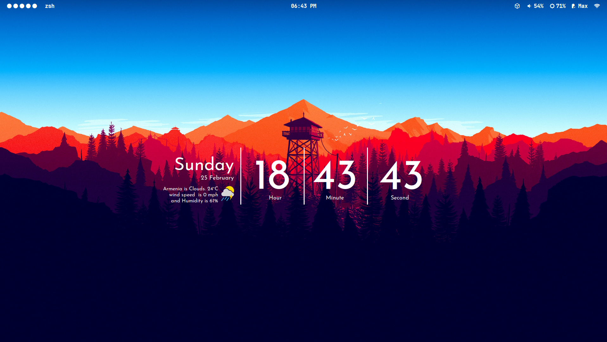
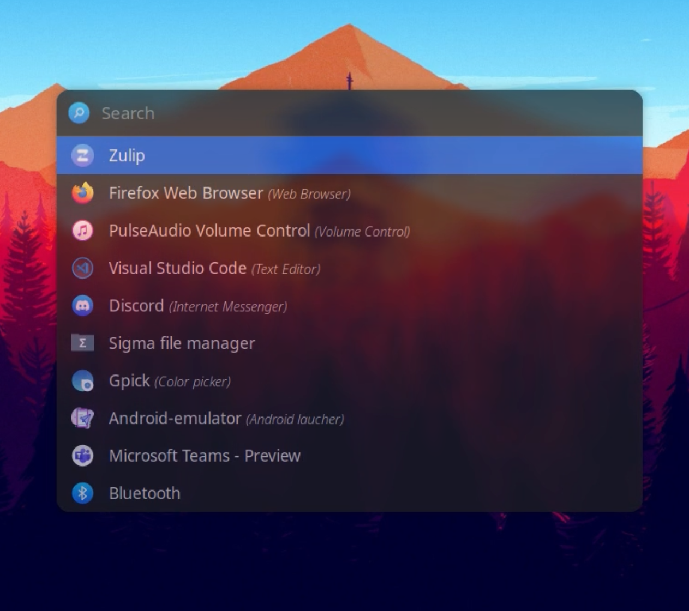
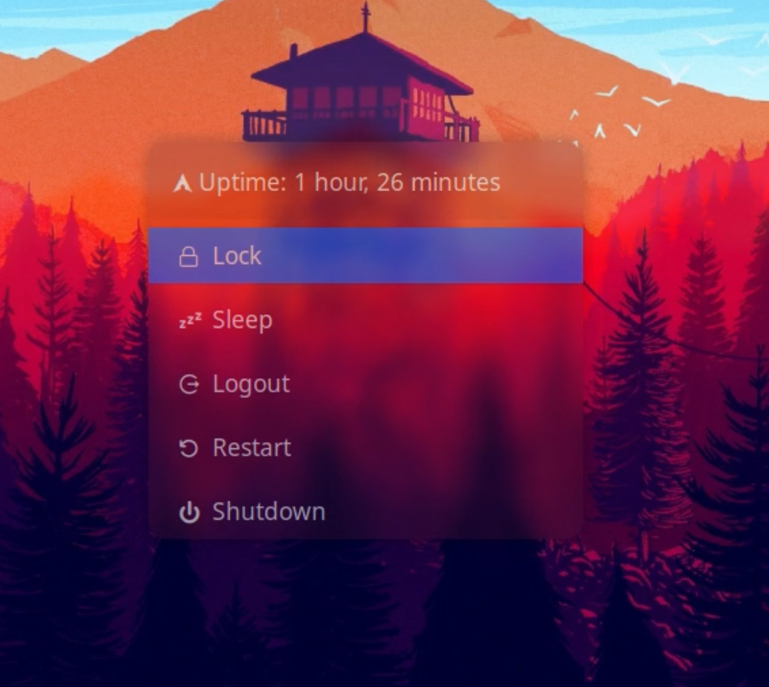

🐧 Arch Linux WM Installation Script.
===

WM config for Archlinux with zsh, tmux, starship, neovim, kitty, feh, dusnt, ly, bspwm, sxhkd, polybar, picom & rofi

This shell script is designed to automate the initial setup of a working environment on Arch Linux with the BSPWM window manager. It installs necessary packages and performs configurations to get the environment ready for use.





## 🚀 Installation

### Prerequisites

- A [Nerd Font](https://www.nerdfonts.com/) installed and enabled in your terminal <b>the following sources are used for this installation </b>.
  
| Font              | Download URl    |
| ------------------| ----------------|
| JetBrains Mono NF | <a href="https://github.com/ryanoasis/nerd-fonts/releases/download/v3.1.1/JetBrainsMono.zip">Download here</a> |
| IosevkaTerm NF    | <a href="https://github.com/ryanoasis/nerd-fonts/releases/download/v3.1.1/IosevkaTerm.zip">Download here</a> |  
| Sarasa Fixed J NF |       |

### Install

- Clone this repository to your Arch Linux system. ```git clone https://github.com/sebasruiz09/dotfiles.git```

- Navigate to the project directory.

- Give execute permission to the installation script. ```chmod +x ./install.sh```
  
- The script will install necessary packages, configure BSPWM, and apply default configurations for various tools such as Zsh, Rofi, etc.

- modify the output of your monitors in the file ```~/.config/bspwm/bspwmrc```

- execute ```xrandr -q``` and change the monitor value in the ```~/.config/polybar/config.ini```

- Reboot your system or start the graphical session.

- Select BSPWM as your window manager and enjoy your configured environment.

### optional step

- if you want the neovim configuration ```git clone https://github.com/sebasruiz09/nvim.git``` in ```user/.config``` directory

## Warning

- In case Polybar doesn't run as expected, check its logs and the monitor's output , Execute ```polybar```

- Monitor the output for any error messages or issues that may help diagnose the problem.

- In case any of the loaded modules doesn't work, compare the properties indicated there with those of your computer

## ❤️ Appearance

### starship


### tmux


### rofi menus
<div float="left">


</div>

## 📝 License

This project is licensed under the [MIT License](https://opensource.org/licenses/MIT) - see the [LICENSE](https://github.com/sebasruiz09/Arch-BSPWM/LICENSE) file for details.
Feel free to modify and distribute the code as per the terms of the MIT License.
