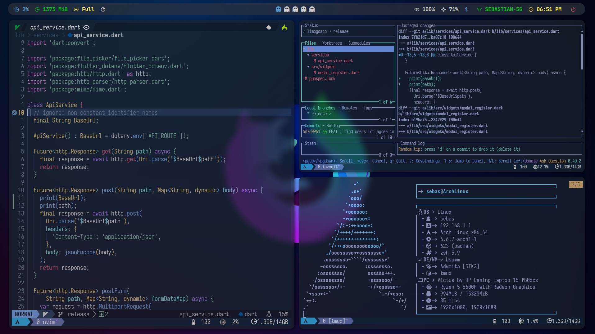

Skyblue
===

Archlinux setup with zsh, neovim, kitty, feh, bspwm, sxhkd, polybar, picom & rofi



# Arch Linux BSPWM Installation Script

This shell script is designed to automate the initial setup of a working environment on Arch Linux with the BSPWM window manager. It installs necessary packages and performs configurations to get the environment ready for use.

## Usage Instructions

1. Clone this repository to your Arch Linux system. ```git clone https://github.com/sebasruiz09/dotfiles.git```

2. Navigate to the project directory.

3. Give execute permission to the installation script. ```chmod +x ./install.sh```

4. The script will install necessary packages, configure BSPWM, and apply default configurations for various tools such as Zsh, Rofi, etc.

5. Reboot your system or start the graphical session.

6. Select BSPWM as your window manager and enjoy your configured environment.

## Warning

- In case Polybar doesn't run as expected, check its logs and the monitor's output , Execute ```polybar```

- Monitor the output for any error messages or issues that may help diagnose the problem.

- In case any of the loaded modules doesn't work, compare the properties indicated there with those of your computer
